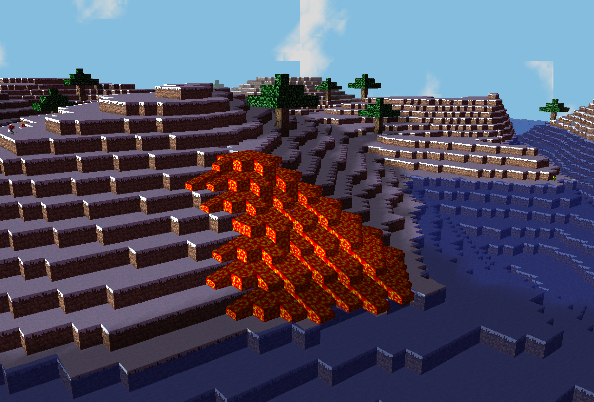

# Mini Minecraft



## Installing Instruction

1. clone current repo ```git clone https://github.com/runjiezhao1/MiniMineCraft.git```
2. install Qt (link: https://www.qt.io/download)
3. use qt to open ```miniMinecraft.pro``` in ```assignment_package``` folder

## Play instruction

1. W: move forward
2. A: move left
3. S: move backward
4. D: move right
5. left click: remove a block
6. right click: place lava
7. F: change fly mode
8. Z: increase speed
9. C: decrease speed

## Content

**Features**
	Runjie Zhao:
		- Fluid Simulation
		- Sound
		- Water Waves
		- Post-process Camera Overlay

**Implementation Details**

***Runjie Zhao***

Fluid Simulation:

	Press add block button to add lava which will form a fluid simulation.
	
	In order to do fluid simulation, I create 8 more blocks which represent 8 directions. Since one block is hard to identify the directions which I will use in computephysics part, 8 blocks is suitable for this effect. 
	
	The problem is that it is hard to render by time. For example, if a water block is in the air, then at the first second, there should be only one block, then in the second there should be eight blocks in eight direction and so on. So I render all of them together at once.

Sound:
	
	In order to achieve the effects, I create QSoundEffect variables in player.cpp file. In default, the player will hear wind and bird sound anywhere. When the player is not in the fly mode and the player is moving, the user will hear walk sound. When the user approaches the water and lava, they will hear water and lava sound.
	
	One problem that I meet is that sometimes, there is no sound. This should be QSoundEffect problem, in order to deal with this issue, the user needs to turn off the computer's audio and then turn it on again.
	
Water Waves:
	
	In order to achieve water waves effects, I modified the vertex shader glsl and change the position of the vertex in it by applying sin function. In order to make the water waves smooth, I can combine 4 continuous water blocks in the same group.
	
Post-process Camera Overlay:

	In order to distort the view under water and lava, I applied noise function according to the time in the post shader to change their uv position.
